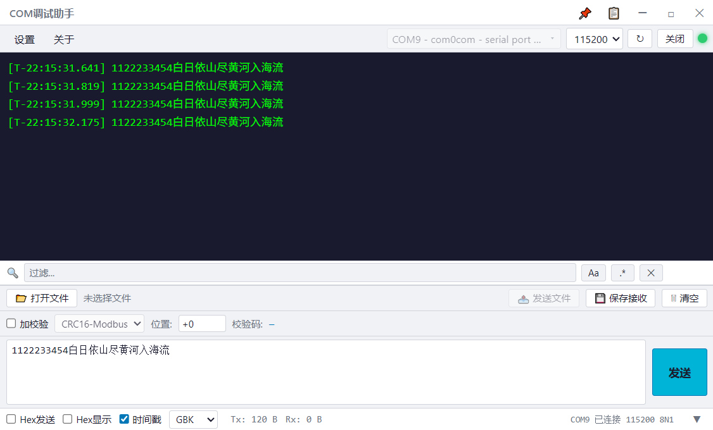
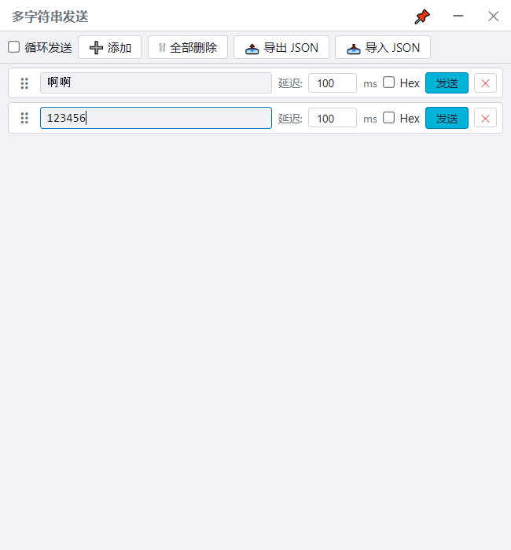
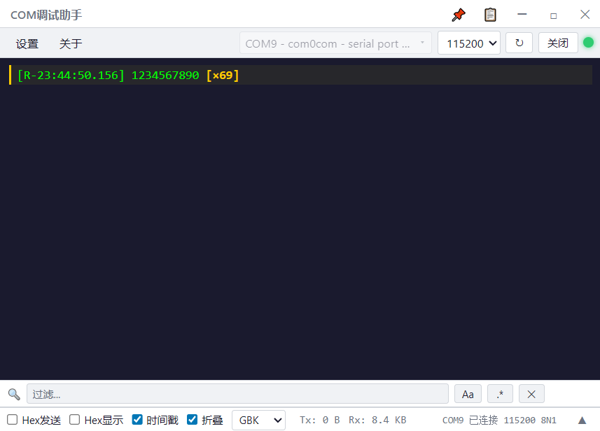

<p align="center">
  
</p>

<h1 align="center">ZCOM</h1>

<p align="center">
  高性能串口调试助手 — Rust + Tauri
</p>

<p align="center">
  <a href="README.md">English</a> · 中文
</p>

<p align="center">
  
  
  
</p>

---

## 缘起

笔者做电子/单片机开发好多年，一直在用sscom。
中间试过无数串口助手，但手感始终不如 sscom，一直没换掉。

但 sscom 有一些从来没人修的痛点：

1. **自动滚屏无法暂停** — 数据一刷想回头看前面的，得手动拽滚动条，松手又弹到底
2. **多字符串轮发占用主窗口** — 面板嵌在主界面里，占半个屏幕，关掉又没法用
3. **UTF-8 编码问题** — 发中文出去大概率乱码，得手动算字节
4. **没有暗色主题** — 实验室灯光昏暗，sscom 的亮白界面格外刺眼
5. **窗口不能置顶** — 边看 PDF 寄存器表边调设备，来回切屏效率极低
6. **接收区搜索/过滤缺失** — 数据量一大，想从中找某条特定报文只能肉眼扫描

借着这波 AI 编程浪潮，斗胆自己动手做一个试试。
写得不好，大家多包涵，欢迎提 issue 和 PR。

## 特性

- 🔥 **MCP（Model Context Protocol）服务** — 内置 MCP HTTP 服务器，AI agent（opencode、Claude Desktop 等）可实时读取串口数据、查询端口状态、发送指令。设置中启用即开，连接地址 `http://localhost:9876/mcp`。
- 🔥 **重复行折叠** — 自动折叠连续重复行显示为 <code>[×N]</code>，点击展开，右键菜单支持复制和折叠以下重复项
- ⭐ **串口通信** — 自动枚举 COM 口，显示设备名称，支持 USB 串口热插拔
- ⭐ **双模收发** — 文本/Hex 发送与接收，实时切换
- ⭐ **接收过滤** — 按关键词/正则过滤接收区，支持大小写开关，Ctrl+F 快速定位
- ⭐ **多字符串发送** — 独立窗口，条目拖拽排序，独立 Hex/延迟控制，循环发送，JSON 导入导出
- ⭐ **自动滚屏** — 数据滚动时自动暂停，滚动到底自动继续
- ⭐ **时间戳** — 收发双向时间戳标记
- ⭐ **置顶窗口** — 主窗口和多字符串窗口均支持置顶
- ⭐ **主题切换** — 深色/浅色/系统/高对比
- ⭐ **编码支持** — UTF-8 / GBK 可选，解决中文乱码问题
- ⭐ **校验码** — CRC16-Modbus / CRC32 / ADD8 / XOR8，支持自定义插入位置
- ⭐ **文件发送** — 选择文件分块发送，支持中止
- ⭐ **接收保存** — 接收区数据保存到文件
- ⭐ **界面设置** — 字号、字体、颜色自定义
- ⭐ **配置持久化** — 所有设置自动保存

## 截图

<p align="center">
  
  <br>
  <em>主界面 — 深色主题 + 过滤 + 多字符串面板</em>
</p>

<p align="center">
  
  <br>
  <em>多字符串发送窗口 — 拖拽排序 + 独立 Hex/延迟控制 + 循环发送</em>
</p>

<p align="center">
  
  <br>
  <em>重复行折叠 — 自动折叠连续重复行显示为 <code>[×N]</code>，点击展开，右键菜单支持复制和折叠以下重复项</em>
</p>

## 快速开始

```bash
npm install
npm run tauri dev    # 开发模式
npm run tauri build  # 生产构建
```

## 技术栈

| 层 | 技术 |
|---|---|
| 桌面框架 | Tauri v2 |
| 后端 | Rust — serialport / encoding_rs / crc |
| 前端 | 原生 HTML / CSS / JS |
| 构建 | Vite + @tauri-apps/cli |

## 下载

访问 [Releases](https://github.com/Martlet-Tech/Zcom/releases) 页面下载最新版本。

## License

MIT
